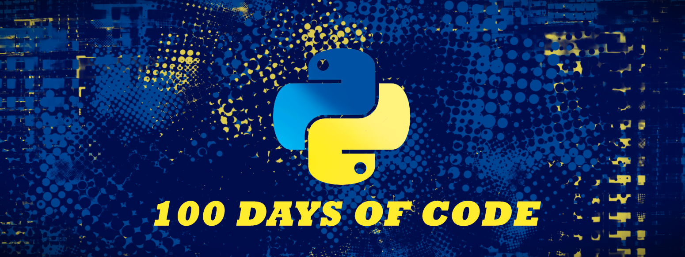

# 100 Days of Code: Python

> Udemy Course: [100 Days of Code: The Complete Python Pro Bootcamp for 2023](https://www.udemy.com/course/100-days-of-code/)

## 🔰 Beginner 
- [Day 01:](https://github.com/cecirio/100-days-of-code/tree/main/logs/day01) Working With Variables in Python to Manage Data
- [Day 02:](https://github.com/cecirio/100-days-of-code/tree/main/logs/day02) Understanding Data Types and How to Manipulate Strings
- [Day 03:](https://github.com/cecirio/100-days-of-code/tree/main/logs/day03) Control Flow and Logical Operators
- [Day 04:](https://github.com/cecirio/100-days-of-code/tree/main/logs/day04) Randomisation and Python Lists
- [Day 05:](https://github.com/cecirio/100-days-of-code/tree/main/logs/day05) Python Loops
- [Day 06:](https://github.com/cecirio/100-days-of-code/tree/main/logs/day06) Python Functions & Karel
- [Day 07:](https://github.com/cecirio/100-days-of-code/tree/main/logs/day07) Hangman
- [Day 08:](https://github.com/cecirio/100-days-of-code/tree/main/logs/day08) Function Parameters & Caesar Cipher
- [Day 09:](https://github.com/cecirio/100-days-of-code/tree/main/logs/day09) Dictionaries, Nesting and The Secret Auction
- [Day 10:](https://github.com/cecirio/100-days-of-code/tree/main/logs/day10) Functions with Outputs
- [Day 11:](https://github.com/cecirio/100-days-of-code/tree/main/logs/day11) The Blackjack Capstone Project
- [Day 12:](https://github.com/cecirio/100-days-of-code/tree/main/logs/day12) Scope & Number Guessing Game
- [Day 13:](https://github.com/cecirio/100-days-of-code/tree/main/logs/day13) Debugging: How to Find and Fix Errors in Your Code
