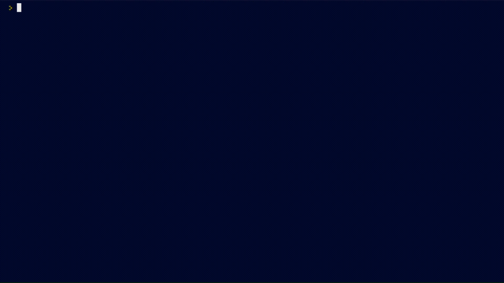

# Day 4 - Randomisation and Python Lists
## Rock Paper Scissors



[Replit @RD3NI - Treasure Island](https://replit.com/@RD3NI/rock-paper-scissors)

## Exercises
### Excercise 1 - Heads or Tails
**Instructions:**
- Write a virtual coin toss program. It will randomly tell the user "Heads" or "Tails".
- Generate a random number, either 0 or 1. Then use that number to print out Heads or Tails.
> IMPORTANT: The first letter should be capitalised and spelt exactly like in the example e.g. Heads, not heads.

> e.g. 1 means Heads 0 means Tails

**Output Example:**
```
Heads
```

or

```
Tails
```

**Code**
<details><summary>Solution</summary>
<p>

```Python
#Remember to use the random module
#Hint: Remember to import the random module here at the top of the file. 🎲
import random	 
#Write the rest of your code below this line 👇

coin = random.randint(0, 1)

if coin == 0:
    coin = "Tails"
elif coin == 1:
    coin = "Heads"

print(coin)
```

</p>
</details>

#

### Excercise 2 - Banker Roulette - Who will pay the bill?
**Instructions:**
- Write a program that will select a random name from a list of names. The person selected will have to pay for everybody's food bill.
> IMPORTANT: You are not allowed to use the **choice()** function.
- Use the **len()** function
> NOTE: Lists start at index 0

**Input Example:**
```
Jim, Pam, Michael, Dwight, Angela, Kevin
```

**Output Example:**
```
Dwight is going to buy the meal today!
```

**Code**
<details><summary>Solution</summary>
<p>

```Python
# Import the random module here
import random
# Split string method
names_string = input("Give me everybody's names, separated by a comma. ")
names = names_string.split(", ")
# 🚨 Don't change the code above 👆

#Write your code below this line 👇

num_of_names = len(names)
num_of_names -= 1

pay = random.randint(0, num_of_names)

bill_pay = names[pay]

print(f"{bill_pay} is going to buy the meal today!")
```

</p>
</details>

#

### Excercise 3 - Treasure Map
**Instructions:**
- Write a program that will mark a spot with an "X" on the map using a two-digit system. 
- There is a variable called map in the beginning of the code
- This map contains a nested list. When map is printed this is what the nested list looks like:

```
[['⬜️', '⬜️', '⬜️'],['⬜️', '⬜️', '⬜️'],['⬜️', '⬜️', '⬜️']]
```
- To make it easier to undersrand, `print(f"{row1}\n{row2}\n{row3}")` is used to format the 3 lists to be printed as a 3 by 3 square, each on a new line. 

```
['⬜️', '⬜️', '⬜️']

['⬜️', '⬜️', '⬜️']

['⬜️', '⬜️', '⬜️']
```
> Now it looks like a coordinates map.

- The first digit in the input will specify the column (the position on the horizontal axis).
- The second digit in the input will specify the row number (the position on the vertical axis).
- First, the program must take the user input and convert it to a usable format.
- Next, use that input to update the nested list with an "x". 
- Keep in mind that the nested list map actually looks like this: `[['⬜️', '⬜️', '⬜️'],['⬜️', '⬜️', '⬜️'],['⬜️', '⬜️', '⬜️']]`.
> Remember Lists always begin at 0 and they are accessed from out to in. So if `list=[[A,B,C],[E,F,G]]` then `E = list[1][0]`.

**Input Example:**
```
23 
```

**Output Example:**
```
['⬜️', '⬜️', '⬜️']
['⬜️', '⬜️', '⬜️']
['⬜️', 'X', '⬜️']
```

**Code**
<details><summary>Solution</summary>
<p>

```Python
# 🚨 Don't change the code below 👇
row1 = ["⬜️","️⬜️","️⬜️"]
row2 = ["⬜️","⬜️","️⬜️"]
row3 = ["⬜️","⬜️","️⬜️"]
map = [row1, row2, row3]
print(f"{row1}\n{row2}\n{row3}")
position = input("Where do you want to put the treasure? ")
# 🚨 Don't change the code above 👆

#Write your code below this row 👇

column = int(position[0])
row = int(position[1])      

map[row - 1][column -1] = "X"

#Write your code above this row 👆

# 🚨 Don't change the code below 👇
print(f"{row1}\n{row2}\n{row3}")

```

</p>
</details>

#
