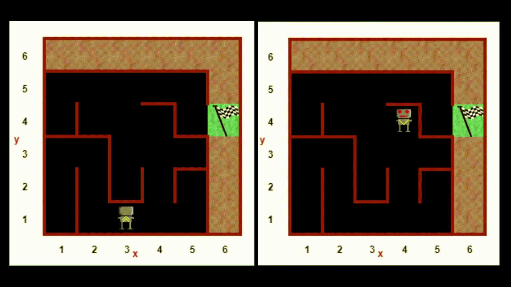
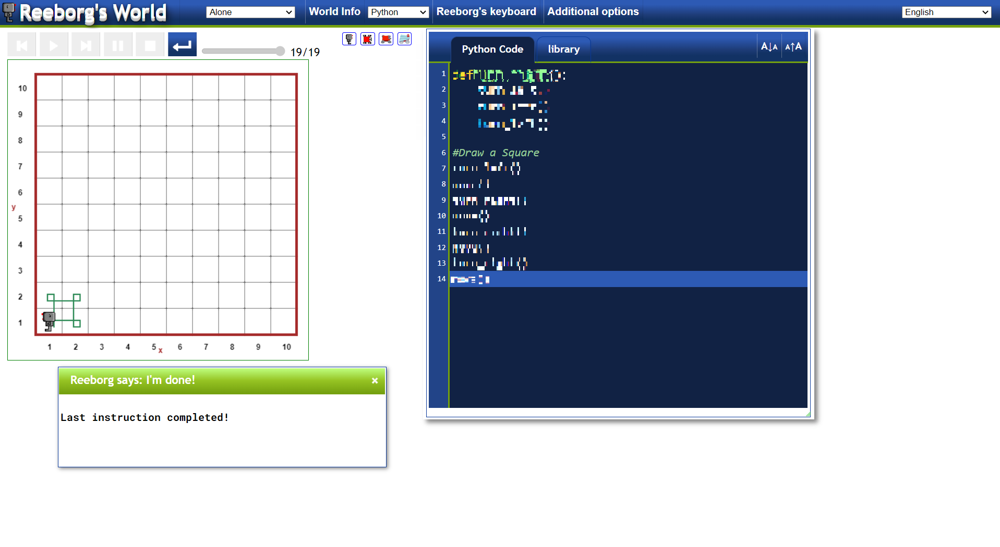
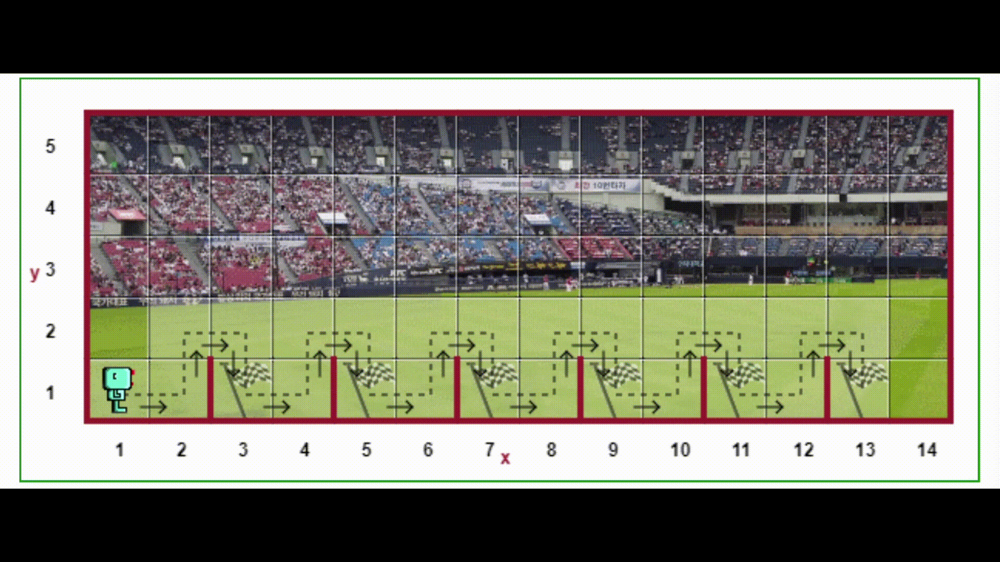

# Day 6 - Python Functions & Karel
## Escaping the Maze




## Exercises
### Excercise 1 - Defining and Calling Python Functions
**Instructions:**
</br> [Reeborg's World](https://reeborg.ca/reeborg.html?lang=en&mode=python&menu=worlds%2Fmenus%2Freeborg_intro_en.json&name=Alone&url=worlds%2Ftutorial_en%2Falone.json) is intended to help beginners learn programming, using Python in a Karel like fashion. Python is utilised to move a simple robot named Reeborg that resides in an environment consisting of a grid-like map.
- Using the commands available in Reeborg's Keyboard, define a function that allows him to turn right.
- Afterwards code instructions for Reeborg to move in a square by calling the **turn_right()** function when necessary.
> Functions help reduce the amount of lines in code.



**Code**
<details><summary>Solution</summary>
<p>

```Python
def turn_right():
    turn_left()
    turn_left()
    turn_left()
    
#Draw a Square
turn_left()
move()
turn_right()
move()
turn_right()
move()
turn_right()
move()
```

</p>
</details>

#

### Excercise 2 - The Hurdles Loop Challenge
**Instructions:**
</br> **Reeborg's World Hurdles Challenge 1**
- Reeborg has entered a hurdles race. Make him run the course, following the path shown.

**What you need to know:**
- The functions **move()** and **turn_left()**.

**Difficulty level**
</br>🤖⬛⬛⬛⬛⬛⬛⬛⬛⬛


**More Advanced**
</br>You may have noticed that your solution has some repeated patterns. If you know how to define functions, define a function named **jump()** and use it to simplify your program.

**Difficulty Level**
</br>🤖🤖⬛⬛⬛⬛⬛⬛⬛⬛

**Code**
<details><summary>Solution</summary>
<p>

```Python
def turn_right():
    turn_left()
    turn_left()
    turn_left()
    
def jump():
    move()
    turn_left()
    move()
    turn_right()
    move()
    turn_right()
    move()
    turn_left()
    
for step in range(6):
    jump()
```

</p>
</details>

#

### Excercise 3 - While Loops
**Instructions:**
</br> **Reeborg's World Hurdles Challenge 2**
- Reeborg has entered a hurdle race, but he does not know in advance how long the race is. Make him run the course, following a path similar to the one shown, but stopping at the only flag that will be shown after the race has started.

**What you need to know:**
- The functions **move()** and **turn_left()**.
- The condition **at_goal()** and its negation.
- How to use a **while** loop.
> The program should also be valid for world Hurdles 1.

**Difficulty Level**
</br>🤖🤖🤖⬛⬛⬛⬛⬛⬛⬛



**Code**
<details><summary>Solution</summary>
<p>

```Python
def turn_right():
    turn_left()
    turn_left()
    turn_left()
    
def jump():
    move()
    turn_left()
    move()
    turn_right()
    move()
    turn_right()
    move()
    turn_left()
    
while at_goal() != True:
    jump()
    
#or

#while not at_goal():
    #jump()
```

</p>
</details>

#

### Excercise 4 - Hurdles Challenge Using While Loops
**Instructions:**
</br>**Reeborg's World Hurdles Challenge 3**
- Reeborg has entered a hurdle race. Make him run the course, following the path shown.
- The position and number of hurdles changes each time this world is reloaded.

**What you need to know:**
- The functions **move()** and **turn_left()**.
- The conditions **front_is_clear()** or **wall_in_front()**, **at_goal()**, and their negation.
- How to use a **while** loop and an **if** statement.
> The program should also be valid for worlds **Hurdles 1** and **Hurdles 2**.

**Difficulty Level**
</br>🤖🤖🤖🤖⬛⬛⬛⬛⬛⬛


**Code**
<details><summary>Solution</summary>
<p>

```Python
def turn_right():
    turn_left()
    turn_left()
    turn_left()
    
def jump():
    turn_left()
    move()
    turn_right()
    move()
    turn_right()
    move()
    turn_left()
    
while at_goal() != True:
    if wall_in_front():
        jump()
    else:
        move()
        
#or

#while not at_goal():
#    if wall_in_front():
#        jump():
#    else:
#        move()
```

</p>
</details>

#

### Excercise 5 - Jumping Over Hurdles With Variable Heights
**Instructions:**
</br>**Reeborg's World Hurdles Challenge 4**
- Reeborg has entered a hurdle race. Make him run the course, following the path shown.
- The position, the height and the number of hurdles changes each time this world is reloaded.

**What you need to know:**
- You should be able to write programs that are valid for worlds **Around 4** and **Hurdles 3**, and combine them for this last hurdles race.
> Your program should also be valid for worlds **Hurdles 1**, **Hurdles 2** and **Hurdles 3**

**Difficulty level**
</br>🤖🤖🤖🤖🤖⬛⬛⬛⬛⬛


**Code**
<details><summary>Solution</summary>
<p>

```Python
def turn_right():
    turn_left()
    turn_left()
    turn_left()
  

def jump():
    turn_left()
    while wall_on_right():
        move()    
    turn_right()
    move()
    turn_right()
    while front_is_clear():
        move()
    turn_left()

    
while at_goal() != True:
    if front_is_clear() and not wall_in_front():
        move()
    else:
        jump()
    
```

</p>
</details>

#
