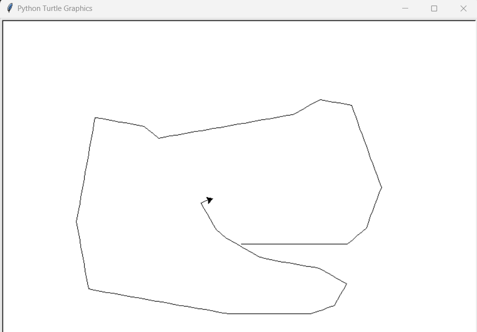

# Day 19 - Instances, State and Higher Order Functions
## Turtle Racing Game


## Excercise
### Create an Etch-A-Sketch
**Instructions:**
- Create a turtle that will allow you to press the "WASD" keys in order to move it in any direction
  - W - Forwards
  - S - Backwards
  - A - Counter-Clockwise
  - D - Clockwise
  - C - Clear Drawing
 


**Code**
<details><summary>Solution</summary>
<p>

```Python
# import Turtle & Screen Class from the turtle module
from turtle import Turtle, Screen

# create a turtle and screen object from imported classes
tom = Turtle()
screen = Screen() #runs window when code is ran


def move_forward():
    tom.forward(10)


def move_backward():
    tom.backward(10)


def turn_left():
    new_heading = tom.heading() + 10
    tom.setheading(new_heading)


def turn_right():
    new_heading = tom.heading() - 10
    tom.setheading(new_heading)


def clear_drawing():
    tom.clear()
    tom.penup()
    tom.home()
    tom.pendown()

screen.listen()
screen.onkey(key="w", fun=move_forward)
screen.onkey(key="s", fun=move_backward)
screen.onkey(key="a", fun=turn_left)
screen.onkey(key="d", fun=turn_right)
screen.onkey(key="c", fun=clear_drawing)
screen.exitonclick()

```

</p>
</details>

#
