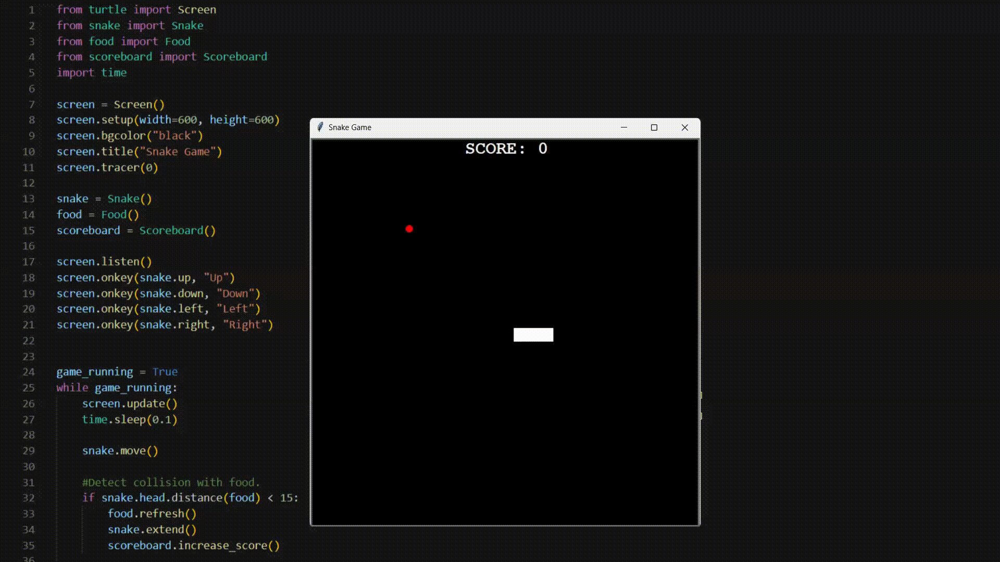

# Day 21 - Build the Snake Game Part 2: Inheritance & List Slicing
## Snake Game Part 2



## Exercises
### Detect Collision with Food 
**Instructions:**
- Create a dot and make it appear at random location on the screen. As soon as the snake head collides with it, the dot should move to another random spot on the grid.
  - Create another file with a class for food
  - Create a turtle in the shape of a dot and make it appear at a random location on the screen
  - Use the distance() method to detect collision with food and create a separate method to call everytime the snake's head collides with it.

**Code**
<details><summary>Solution</summary>
<p>
Create another file and create a food class

```Python
from turtle import Turtle

Class Food(Turtle):
	def __init__(self):
		super().__init__()

```

Create a turtle in the shape of a dot and make it appear at a random location on the screen

```Python
from turtle import Turtle
import random

class Food(Turtle):
  def __init__(self):
    super().__init__()
    self.shape("circle")
    self.color("red")
    self.penup()
    self.shapesize(stretch_len=0.5, stretch_wid=0.5)
    self.speed("fastest")
    random_x = random.randint(-280, 280) 
    random_y = random.randint(-280, 280)
    self.goto(random_x, random_y)
```

Use the distance() method to detect collision with food and create a separate method to call everytime the snake's head collides with it.

```Python
class Food(Turtle):
  def __init__(self):
    super().__init__()
    self.shape("circle")
    self.color("red")
    self.penup()
    self.shapesize(stretch_len=0.5, stretch_wid=0.5)
    self.speed("fastest")
    self.refresh()


  def refresh(self):
    random_x = random.randint(-280, 280) 
    random_y = random.randint(-280, 280)
    self.goto(random_x, random_y)
```

```Python
if snake.head.distance(food) < 15:
	food.refresh()
```

</p>
</details>

#

### Create a Scoreboard and Keep Score
**Instructions:**
- Keep track of the score (how many pices of food the snake has eaten) and display the score. The scoreboard should update after each piece of food.
  - Create a new file for the scoreboard class and create a turtle that will write to the screen
  - Write a function that increases the score
  - Create an if statement so that when the snake's head collides with food, it will increase the score and display the change 

**Code**
<details><summary>Solution</summary>
<p>
Create a new file for the scoreboard class and create a turtle that will write to the screen

```Python
class Scoreboard(Turtle):
	def __init__(self):
		super().__init__()
		self.score = 0
		self.color("white")
		self.penup()
		self.goto(0, 270)
		self.write(f"score: {self.score}", align="center", font=("Comic Sans MS", 20, "normal"))
```

Write a function that increases the score

```Python
def increase_score(self):
	self.score += 1
	self.clear()
	self.write(f"score: {self.score}", align="center", font=("Comic Sans MS", 20, "normal"))
```

Create an if statement so that when the snake's head collides with food, it will increase the score and display the change 

```Python
if snake.head.distance(food) < 15:
	food.refresh()
	scoreboard.increase_score()
```

</p>
</details>

#

### Detect Collisions with the Wall
**Instructions:**
- Terminate the game once the snake's head collides with a wall
  - Create a game_over() function that gets triggered if the snake passes the screen's designated threshold

**Code**
<details><summary>Solution</summary>
<p>
Create a game_over() function that gets triggered if the snake passes the screen's designated threshold

```Python
def game_over(self):
  self.goto(0,0)
  self.write("GAME OVER", align=ALIGMNEMT, font=FONT)
```

```Python
#Detect collision with wall
  if snake.head.xcor() > 280 or snake.head.xcor() < -280 or snake.head.ycor() > 280 or snake.head.ycor() < -280:
    game_running = False
    scoreboard.game_over()
```

</p>
</details>

#

### Detect Collisions with Tail
**Instructions:**
- Add segments to the snale's body every time it collides with the food. If the snake's head collides with any other segments of its body, terminate the game.
  - Divide the snake creation function into separate functions
  - Create a function to create the snake
  - Create a function to create a segment of the snake's body
  - Create a function to extend the snake's body
  - Check for tail collision by looping through all the existing tail segments (except for the head segment) and compare the distance from eachother. If the distance is less than 10, it is a collision.

**Code**
<details><summary>Solution</summary>
<p>
Create a function to create the snake

```Python
def create_snake(self):
  for position in STARTING_POSITIONS:
    self.add_segment(position)
```

Create a function to create a segment of the snake's body

```Python
def add_segment(self, position):
  new_seg = Turtle(shape="square")
  new_seg.color("white")
  new_seg.penup()
  new_seg.goto(position)
  self.segments.append(new_seg)
```

Create a function to extend the snake's body

```Python
def extend(self):
  #Add a new segment to the snake
  self.add_segment(self.segments[-1].position())
```

Check for tail collision by looping through all the existing tail segments (except for the head segment) and compare the distance from eachother. If the distance is less than 10, it is a collision.

```Python
#Detect collision with tail
  for segment in snake.segments[1:]:
    if snake.head.distance(segment) < 10:
      game_running = False
      scoreboard.game_over()
```

</p>
</details>
