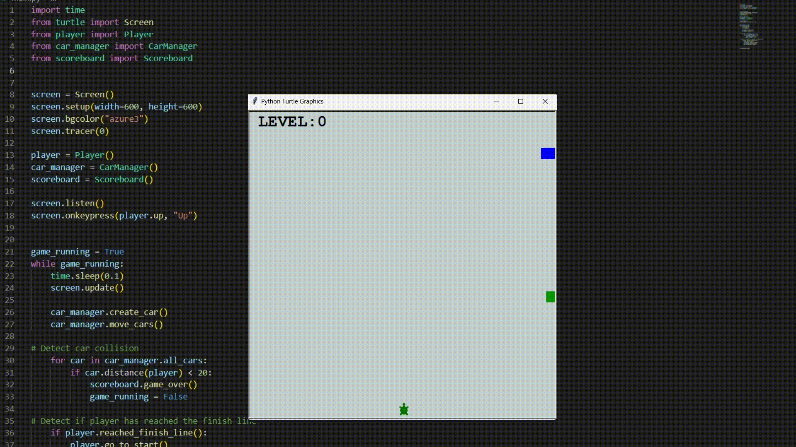

# Day 23 - The Turtle Crossing Capstone Project
## Turtle Crossing Game



[Replit @RD3NI - <Project Name>](https://replit.com/@RD3NI/<project-name>)


## Excersises
### Step 1: Setup the Main Screen
- Setup a screen with a width of 600px and a height of 600px.
- Make sure the screen window remains open until it is clicked to close it.
- Use the tracer() method to skip turtle creation animations and use the update() method to refresh the screen afterwards.

**Code**
<details><summary></summary>
<p>

```Python
import time
from turtle import Screen

screen = Screen()
screen.setup(width=600, height=600)
screen.bgcolor("azure4")
screen.tracer(0)

game_running = True
while game_running:
    time.sleep(0.1)
    screen.update()

screen.exitonclick()
```

</p>
</details>

#

### Step 2: Create the Player Behaviour
- Create a new file named player.py to add the Player class.
- Create a turtle player object that starts at the bottom of the screen.
- Make the turtle player listen for the "Up" keypress to move the turtle north.

**Code**
<details><summary>player.py</summary>
<p>

```Python
from turtle import Turtle
STARTING_POSITION = (0, -280)
TRAVEL_DISTANCE = 10

class Player(Turtle):
    def __init__(self):
        super().__init__()
        self.shape("turtle")
        self.color("DarkGreen")
        self.setheading(90)
        self.penup()
        self.goto(STARTING_POSITION)


    def up(self):
        self.forward(TRAVEL_DISTANCE)
```

</p>
</details>

**Code**
<details><summary>main.py</summary>
<p>

```Python
from player import Player

player = Player()

screen.listen()
screen.onkeypress(player.up, "Up")

```

</p>
</details>

#

### Step 3: Create the Car Behaviour
- 


**Code**
<details><summary>Solution</summary>
<p>

```Python
  print("test")
```

</p>
</details>

#
