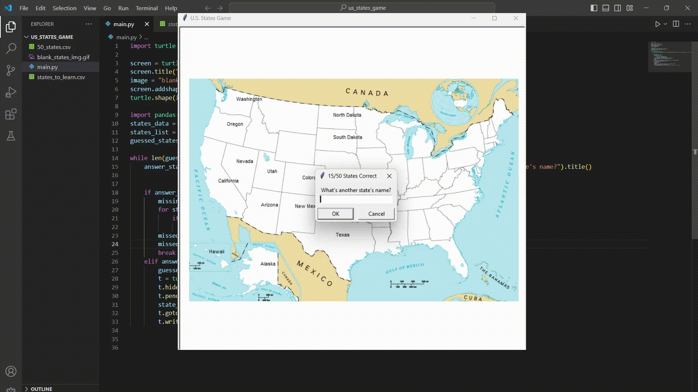

# Day 25 - Working with CSV Data and the Pandas Library
## U.S. States Game



## Exercises
### Excercise 1 - Read .csv Data in Python
**Instructions:**
- Add the .csv  file to the project folder.
- Install the Pandas library to python.
- Print the data to the console

**Code**
<details><summary>Solution</summary>
<p>

```Python
import pandas

data = pandas.read_csv("<file_relative_path.csv>")
print(data)
```

</p>
</details>

#

### Excercise 2 - Print Series and Row with Pandas
**Instructions:**
- Import pandas
- Use type checks using the type() method to see the type of data.
  > NOTE: There are two primary data structures of pandas, Series (1-dimensional) and DataFrame (2-dimensional),
   handle the vast majority of typical use cases in finance, statistics, social science, and many areas of engineering.  
- A DataFrame is nearly the equivalent of the table data set. The Series is equivalent to a column.
  
**Output Examples:**
```
class 'pandas.core.frame.DataFrame' object
```
```
class 'pandas.core.series.Series' object
```
- Create a DataFrame out of the attached .csv file.
- Create a variable that will hold the data for the Series
- Print the Series to the console

**Code**
<details><summary>Print Series</summary>
<p>

```Python
import pandas as pd
states_data = pd.read_csv("50_states.csv")
states = states_data["state"]
print(states)
```

</p>
</details>

<details><summary>Print Row</summary>
<p>

```Python
import pandas
states_data = pandas.read_csv("50_states.csv")
state = states_data[states_data["state"] == "Idaho"]
print(states)
```

</p>
</details>

#

### Excercise 3 - Print Monday's Temperature from weather_data.csv and Convert it to Fahrenheit
**Instructions:**
- Get ahold of the day row for Monday
- Get the first value of the series at index 0
- Make the Celsius to Fahrenheit conversion

**Code**
<details><summary>Solution</summary>
<p>

```Python
monday = data[data.day == "Monday"] 
monday_temp = monday.temp[0]  
mon_temp_f = monday_temp * 9/5 + 32
print(mon_temp_f)
```

</p>
</details>

#

### Excercise 4 - Create a .csv from Scratch Using Data from the Squirrel Census
**Instructions:**
- Extract data to create DataFrame (create a dictionary).
- Name the .csv "Squirel_count.csv"
- Create a small table that only contains the fur color
  (3 colors from the Primary Fur Color series) and the count for each.

**Output Example:**
```
,Fur Color,Count
0,grey,2473
1,red,392
2,black,103
```

**Code**
<details><summary>Solution</summary>
<p>

```Python
import pandas

data = pandas.read_csv("2018_Central_Park_Squirrel_Census_-_Squirrel_Data.csv")
gray_squirrels_count = len(data[data["Primary Fur Color"] == "Gray"])
red_squirrels_count = len(data[data["Primary Fur Color"] == "Cinnamon"])
black_squirrels_count = len(data[data["Primary Fur Color"] == "Black"])

data_dict = {
    "Fur Color": ["Gray", "Cinnamon", "Black"],
    "Count": [gray_squirrels_count, red_squirrels_count, black_squirrels_count]
}

df = pandas.DataFrame(data_dict)
df.to_csv("squirrel_count.csv")

```

</p>
</details>

#
