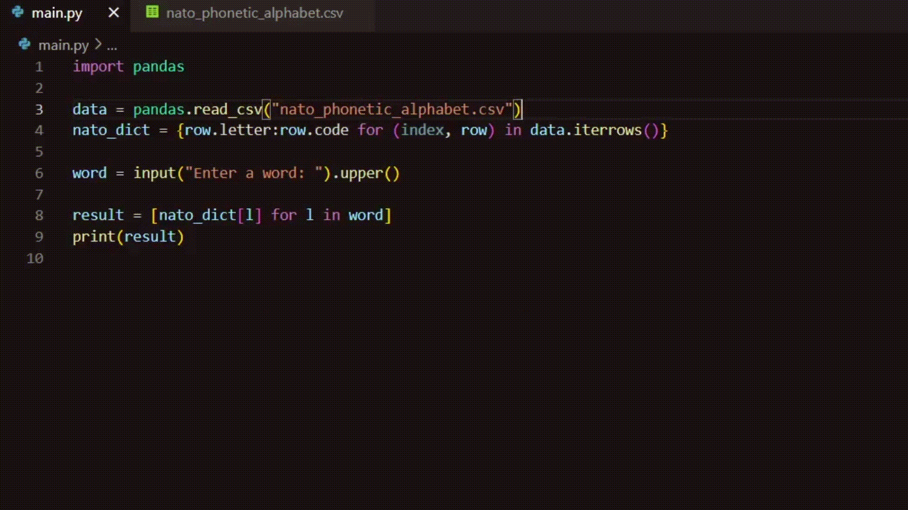

# Day 26 - List Comprehension & the NATO Alphabet
## <NATO Phonetic Alphabet>



## Exercises
### Excercise 1 - Create a list using List Comprehension
**Instructions:**
- Take the following code and rewrite it usinng List Comprehension.

**Code Example:**
```Python
numbers = [1, 2, 3]
new_list = []

for n in numbers:
    add_1 = n + 1
    new_list.append(add_1)

print(new_list)
```

**Output Example:**
```
[2, 3, 4]
```

**Code**
<details><summary>Solution</summary>
<p>

```Python
numbers = [1, 2, 3]
new_list = [n + 1 for n in numbers]
print(new_list)
```

</p>
</details>

#

### Excercise 2 - Add a Conditional to List Comprehension
**Instructions:**
- Make a new list out of an existing list of names varying in length.
- The new list should only include the names with 4 letters or less.

**Ending Result:**
```
names = ['Carl', 'Glen', 'Daryl', 'Rick', 'Michone', 'Maggie']
short_names = ['Carl', 'Glen', 'Rick']
```

**Code**
<details><summary>Solution</summary>
<p>

```Python
names = ['Carl', 'Glen', 'Daryl', 'Rick', 'Michone', 'Maggie']
short_names = [i for i in names if len(i) < 5]
```

</p>
</details>

#

### Excercise 3 - Check for Data Overlap Between Files
**Instructions:**
- There are two files, file1.txt and file2.txt, that contain numbers within them.
- Every number on each of the files is on a new line.
- Use list comprehension to create a new list that contains the numbers that are common in both files.
- Name the new list "result".

**File 1 Example:**
```
1
2
3
```

**File 2 Example:**
```
2
3
4
```

**Ending Result:**
```
result = [2, 3]
```

**Code**
<details><summary>Solution</summary>
<p>

```Python
with open("file1.txt") as f1:
    list1 = f1.readlines()
    
with open("file2.txt") as f2:
    list2 = f2.readlines()
    
result = [int(n) for n in list1 if n in list2]

print(result)
```

</p>
</details>

#

### Excercise 4 - How to Use Dictionary Comprehension
**Instructions:**
- Use dictionary comprehension to create a dictionary out of an existing list
- The dictionary comprehension should generate a random score for each name in the list.

**List Example:**
```
names = ['Luke', 'Leia', 'Anakin', 'Yoda', 'Padme', 'Obi_Wan']
```

**Output Example:**
```
{'Luke': 43, 'Leia': 62, 'Anakin': 12, 'Yoda': 41, 'Padme': 73, 'Obi_Wan': 81}
```

**Code**
<details><summary>Solution</summary>
<p>

```Python
import random

names = ['Luke', 'Leia', 'Anakin', 'Yoda', 'Padme', 'Obi_Wan']
character_scores = {character:random.randint(1, 100) for character in names}
print(character_scores)
```

</p>
</details>

#

### Excercise 5 - Use Dictionary Comprehension with Dictionaries
**Instructions:**
- Use dictionary comprehension to create a dictionary called weather_f.
- The dictionary comprehension will take each temperature in degrees Celsius and connvert it to degrees Fahrenheit.
- To convert temp_c into temp_f use the following formula: **(temp_c * 9/5) + 32 = temp_f**.
  

**Starting Dictionary:**
```
weather_c = {
'Monday': 12,
'Tuesday': 14,
'Wednesday': 15,
'Thursday': 14,
'Friday': 21,
'Saturday': 22,
'Sunday': 24
}
```

**Output Example:**
```
{'Monday': 53.6, 'Tuesday': 57.2, 'Wednesday': 59.0, 'Thursday': 57.2, 'Friday': 69.8, 'Saturday': 71.6, 'Sunday': 75.2}
```

**Code**
<details><summary>Solution</summary>
<p>

```Python
weather_c = eval(input("Input: "))

weather_f = {day:(temp_c * 9/5) + 32 for (day, temp_c) in weather_c.items()}
print(weather_f)
```

</p>
</details>

#

### Excercise 6 - Iterate Over a Pandas DataFrame
**Instructions:**
- Use Pandas to create a new DataFrame out of an existing dictionary.
- Use dictionary comprehension and iterrows() function to iterate through the DataFrame rows.

**Output Example:**
```
Harry
Hermione
Ron
```

**Code**
<details><summary>Solution</summary>
<p>

```Python
student_dict = {
    'student': ['Harry', 'Hermione', 'Ron'],
    'points': [76, 98, 56]
}

import pandas

student_data_frame = pandas.DataFrame(student_dict)

for (index, row) in student_data_frame.iterrows():
    print(row.student) 
```

</p>
</details>

#

#
